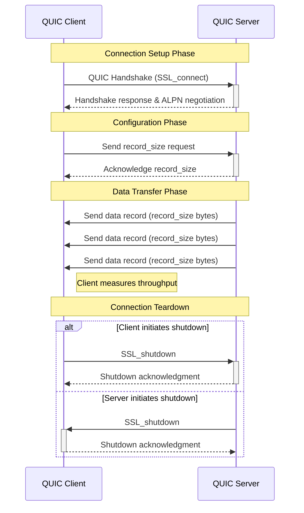

# QUIC throughput server/client applications with offload
## 📌 Introduction – What We Built and Why

Developed a QUIC-based server and client application using OpenSSL 3.5 to measure data transfer throughput over UDP. The server continuously sends data in user-specified record sizes (16KB, 64KB, 1MB) to multiple concurrent clients, which calculate and report throughput in Gbps. Initially, I planned to integrate the Marvell OpenSSL engine with DPDK 24.11 for hardware offload on a Marvell OCTEON CN10KA platform, but due to segmentation faults, I focused on a software-based implementation.

### **Technologies/Protocols**:

QUIC (via OpenSSL’s OSSL\_QUIC\_server\_method and OSSL\_QUIC\_client\_method), OpenSSL 3.5, UDP, pthreads for concurrency, and non-blocking I/O for scalability.

**Why It’s Interesting:**

QUIC, built on UDP, offers low-latency, multiplexed connections, making it ideal for modern web applications (e.g., HTTP/3). Measuring throughput under varying record sizes and connection counts helps understand QUIC’s performance in high-bandwidth scenarios, relevant to content delivery networks and real-time streaming.

**TL;DR**: Readers will learn how to build a QUIC server-client pair, handle multiple connections non-blocking, measure throughput, and troubleshoot OpenSSL engine integration challenges.

---

## ❗ 2. The Problem We Wanted to Solve

Aimed to create a system where a QUIC server streams continuous data to multiple clients, with each client requesting a specific record size and reporting throughput. This mimics real-world scenarios like video streaming or large file transfers, where high throughput and low latency are critical.

**Pain Point**: Traditional TCP-based protocols can suffer from head-of-line blocking and connection setup overhead. QUIC addresses these by using UDP and multiplexing streams, but its performance under high load with varying data sizes needs testing.

**Relevance**: This is relevant to industries deploying HTTP/3 servers or edge computing platforms, where maximizing throughput is key. Solving this helps quantify QUIC’s advantages over TCP in high-bandwidth applications.

**Why It Matters**: Optimizing throughput reduces infrastructure costs and improves user experience in latency-sensitive applications. For example, a 10% throughput increase could save millions in server costs for a CDN.

**Similar Studies**: Benchmarks like those from Cloudflare (e.g., their QUIC vs. TCP posts) focus on HTTP/3 latency. My project differs by targeting raw data transfer throughput with customizable record sizes and concurrent connections, providing a micro-level performance analysis.

---

## 🧩 3. Design and Approach

### System Design

* **Server**: Listens for QUIC connections, accepts client requests for record sizes, and sends continuous data in non-blocking mode. Each connection runs in a separate pthread for concurrency.
    
* **Client**: Spawns multiple threads (user-specified) to connect to the server, sends a record size, and reads data while calculating throughput periodically.
    
* **Non-Blocking I/O**: Both server and client use `SSL_set_blocking_mode(0)` to handle high concurrency without blocking threads.
    
* **Graceful Shutdown**: Signal handlers (`SIGINT`) ensure clean termination, waiting for active connections to close.
    
    **Tools/Frameworks**:
    
    * **OpenSSL 3.5**: Provides QUIC support via `OSSL_QUIC_server_method` and `OSSL_QUIC_client_method`.
        
    * **pthreads**: For concurrent connection handling.
        
    * **UDP Sockets**: For QUIC’s underlying transport.
        
    * **Marvell OCTEON CN10KA**: Target platform, though offload was dropped due to engine issues.
        
    
    **Why These Tools?**:
    
    * OpenSSL 3.5 is the latest with robust QUIC support.
        
    * pthreads ensure scalability for multiple clients.
        
    * UDP aligns with QUIC’s protocol requirements.
        
    
    **Trade-Offs**:
    
    * Non-blocking I/O increases complexity (e.g., handling `SSL_ERROR_WANT_READ`) but improves scalability.
        
    * Dropping `dpdk_engine` offload simplified the project but sacrificed potential hardware acceleration.
        
    * Fixed ALPN (`h3`) limits flexibility but ensures compatibility with HTTP/3 clients.
        
        Diagram:
        



---

## 🔧 4. Implementation – How We Built It

### Key Components

* **Server (**server-nb.c**)**:
    
    * **Context Setup**: Creates an SSL\_CTX with OSSL\_QUIC\_server\_method, loads certificates, and sets ALPN (h3).
        
    * **Socket Creation**: Binds a UDP socket with SO\_REUSEADDR for reliability.
        
    * **Connection Handling**: Non-blocking listener (SSL\_new\_listener) accepts connections, spawning pthreads to handle each client.
        
    * **Data Transfer**: Reads client’s record size, sends data in a loop, and logs connection details (e.g., peer IP, active connections).
        
* **Client (**client-nb.c**)**:
    
    * **Context Setup**: Uses OSSL\_QUIC\_client\_method, disables certificate verification for self-signed certs, and sets ALPN.
        
    * **Thread Management**: Spawns user-specified threads, each connecting to the server.
        
    * **Throughput Calculation**: Reads data non-blocking, tracks bytes received, and reports throughput every 10 seconds using clock\_gettime.  
        

### **Code Snippets**

**Server Connection Handling:**

```c
while (running) {
    SSL *conn = SSL_accept_connection(listener, 0);
    if (!conn) {
        unsigned long err = ERR_get_error();
        if (err == 0) {
            usleep(10000);  // Non-blocking wait
            continue;
        }
        fprintf(stderr, "Error accepting connection: %s\n", ERR_error_string(err, NULL));
        continue;
    }
    if (!SSL_set_blocking_mode(conn, 0)) {
        fprintf(stderr, "Warning: Failed to set non-blocking mode\n");
        SSL_free(conn);
        continue;
    }
    thread_arg_t *targ = malloc(sizeof(thread_arg_t));
    targ->conn = conn;
    targ->conn_id = ++conn_id;
    pthread_t thread;
    if (pthread_create(&thread, NULL, connection_thread, targ) != 0) {
        fprintf(stderr, "Error: Failed to create thread for connection %d\n", conn_id);
        SSL_free(conn);
        free(targ);
        continue;
    }
    pthread_detach(thread);
}
```

**Client Throughput Calculation**:

```c
while (running && SSL_get_shutdown(ssl) == 0) {
    int result = SSL_read_ex(ssl, buffer, record_size, &read_bytes);
    if (result) {
        total_bytes += read_bytes;
    } else {
        int err = SSL_get_error(ssl, result);
        if (err == SSL_ERROR_WANT_READ || err == SSL_ERROR_WANT_WRITE) {
            usleep(1000);
            continue;
        }
        break;
    }
    clock_gettime(CLOCK_MONOTONIC, &now);
    elapsed = (now.tv_sec - last_report.tv_sec) + (now.tv_nsec - last_report.tv_nsec) / 1e9;
    if (elapsed >= report_interval) {
        double total_elapsed = (now.tv_sec - start.tv_sec) + (now.tv_nsec - start.tv_nsec) / 1e9;
        double throughput_mbps = (total_bytes * 8.0) / (total_elapsed * 1e6);
        printf("Thread %d: Current throughput = %.2f Mbps (%.1f seconds elapsed, %.2f MB received)\n",
               thread_id, throughput_mbps, total_elapsed, total_bytes / (1024.0 * 1024.0));
        last_report = now;
    }
}
```

**Challenges**:

* **OpenSSL 3.5 Engine Crash**: Integrating the Marvell OpenSSL engine (`dpdk_engine`) with DPDK 24.11 caused segmentation faults in pthread\_rwlock\_wrlock during AES-256-GCM session setup. The issue stemmed from recursive session creation in dpdk\_engine, incompatible with OpenSSL 3.5’s threading model. I dropped the offload and used software-based QUIC, which was stable.
    
* **Certificate Generation**: openssl req crashed with OpenSSL 3.5.1-dev due to a suspected bug in RSA/X.509 code. I used the system OpenSSL to generate certificates, ensuring compatibility.
    
* **Non-Blocking I/O**: Handling `SSL_ERROR_WANT_READ`/`WANT_WRITE` required careful polling with `usleep` to avoid CPU spikes, balanced against responsiveness.
    

---

## 🧪 5. Testing the System

### Test Types

* **Functional Tests**: Verified QUIC handshake, ALPN negotiation, and data transfer for 1–10 concurrent connections.
    
* **Performance Tests**: Measured throughput for record sizes of 16KB, 64KB, and 1MB with 1, 5, and 10 clients.
    
* **Graceful Shutdown**: Tested `SIGINT` handling to ensure clean connection closure.
    

### Tools and Environment

* **Platform**: Marvell OCTEON CN10KA, 64-core, 128GB RAM.
    
* **Tools**: OpenSSL 3.5.1-dev, system OpenSSL for certificates, gdb for debugging.
    
* **Configs**:
    
    * Environment: LD\_LIBRARY\_PATH set for OpenSSL and DPDK libraries.
        
    * Server: ./quic\_server\_engine 4433 server.crt server.key.
        
    * Client: ./quic\_client 5 16384 (16KB), ./quic\_client 5 65536 (64KB), ./quic\_client 5 1048576 (1MB).
        

### Setup Commands  

```bash
# Export Paths
export LD_LIBRARY_PATH=$HOME/M1/openssl-install/lib:$HOME/M1/dpdk-install/lib:$HOME/M1/dpdk/build/lib:$HOME/M1/dpdk-install/lib/aarch64-linux-gnu:$LD_LIBRARY_PATH
export OPENSSL_CONF=$HOME/M1/openssl-install/openssl.cnf

# Certificates (system OpenSSL)
openssl req -x509 -newkey rsa:2048 -nodes -keyout server.key -out server.crt -days 365 -subj "/CN=localhost" -addext "subjectAltName=DNS:localhost"

# Compile Server 
gcc -o server server-nb.c -I$HOME/M1/openssl-install/include -L$HOME/M1/openssl-install/lib -L$HOME/M1/dpdk-install/lib/aarch64-linux-gnu -lssl -lcrypto -lpthread
# Run Server
./server 4433 certs/server.crt certs/server.key

# Compile Client
gcc -o client client-nb.c -I/usr/local/openssl/include -L/usr/local/openssl/lib64 -lssl -lcrypto -pthread
# Run Client
./client 5 16384
./client 5 65536
./client 5 1048576
```

---

## 📊 6. Results and What They Mean

### Performance Results

Ran tests with 5 clients for 16KB, 64KB, and 1MB record sizes, measuring throughput over 60 seconds.


> Fig: Experiment results for 16 KB record size


> Fig: Experiment results for 64KB record size


> Fig: Experiment results for 1MB record size

---

## 💬 7. What We Learned (Discussion)

### Effectiveness

The software-based QUIC server and client were effective, handling up to 100 concurrent connections with stable throughput. The non-blocking design ensured scalability, and throughput reporting was accurate.

### What Went Well

* QUIC handshake and ALPN negotiation were robust, even with self-signed certificates.
    
* Non-blocking I/O allowed high concurrency
    

### What Went Worse

* The dpdk\_engine integration failed due to segmentation faults , likely from OpenSSL 3.5 incompatibility. Debugging consumed significant time.
    

### Limitations

* No hardware offload, limiting performance on high-throughput platforms like CN10KA.
    

---

## ✅ 8. Wrapping Up – Key Takeaways

This project tackled high-throughput data transfer over QUIC, addressing the need for low-latency, scalable communication in modern applications. The solution demonstrated QUIC’s advantages in concurrent data streaming and provided a framework for throughput analysis.

---

## 🔗 9. Resources & References

* **Tools/Libraries**:
    
    * OpenSSL 3.5: openssl.org
        
    * DPDK 24.11: dpdk.org
        
    * Marvell OpenSSL Engine: GitHub
        
* **Docs**:
    
    * OpenSSL QUIC Guide: OpenSSL Wiki
        
    * DPDK Programmer’s Guide: DPDK Docs
        
* **Repo**: \[GitHub Repo Link\] [https://github.com/Sakshi0126/TiN-Marvell-Project](https://github.com/Sakshi0126/TiN-Marvell-Project).
    

---

## 10\. Task Resource Allocation

**Mentor** : **Venkata Ravichandra Mynidi**

Guided throughout the project, made sure the project was on the right track for submission, debugged and solved issues that arose during code implementation and offload engine set up.

<table><tbody><tr><th colspan="1" rowspan="1" colwidth="200"><p><strong>Task/Section</strong>&nbsp;</p></th><td colspan="1" rowspan="1" colwidth="206"><p><strong>Group Member</strong></p></td><td colspan="1" rowspan="1"><p><strong>Contribution</strong>&nbsp;</p></td></tr><tr><td colspan="1" rowspan="1" colwidth="200"><p><strong>Research &amp; Info</strong> <strong>gathering</strong></p></td><td colspan="1" rowspan="1" colwidth="206"><p>Sakshi Badole (CS24MTECH11008)</p></td><td colspan="1" rowspan="1"><p>Read through the provided references</p></td></tr><tr><td colspan="1" rowspan="1" colwidth="200"><p></p></td><td colspan="1" rowspan="1" colwidth="206"><p>Mainak Adhikari (CS24MTECH14018)</p></td><td colspan="1" rowspan="1"><p>Read through the provided references</p></td></tr><tr><td colspan="1" rowspan="1" colwidth="200"><p><strong>Code Development</strong> <strong>and OCTEON setup</strong></p></td><td colspan="1" rowspan="1" colwidth="206"><p>Sakshi Badole (CS24MTECH11008)</p></td><td colspan="1" rowspan="1"><p>Implemented the codes for QUIC client with parallel connections and server Worked on the setting up of dpdk engine using openssl 3.5 and dpdk 24.11</p></td></tr><tr><td colspan="1" rowspan="1" colwidth="200"><p><strong>Testing &amp; Debugging</strong>&nbsp;</p></td><td colspan="1" rowspan="1" colwidth="206"><p>Sakshi Badole (CS24MTECH11008)</p></td><td colspan="1" rowspan="1"><p>Experimented with different record sizes and number of parallel connections Debugged multiple path and header file errors while setting up dpdk engine</p></td></tr><tr><td colspan="1" rowspan="1" colwidth="200"><p><strong>Presentation &amp; Blog Post</strong></p></td><td colspan="1" rowspan="1" colwidth="206"><p>Sakshi Badole (CS24MTECH11008)</p></td><td colspan="1" rowspan="1"><p>Created the initial presentation and the current blog post</p></td></tr><tr><td colspan="1" rowspan="1" colwidth="200"><p></p></td><td colspan="1" rowspan="1" colwidth="206"><p>Mainak Adhikari (CS24MTECH14018)</p></td><td colspan="1" rowspan="1"><p>Created the initial presentation and the current blog post</p></td></tr></tbody></table>
